<div align="center">

# Crypto From Scratch

**Comprendre les nombres. Construire les algorithmes. Observer leurs limites.**

Python 3.10+ · Bibliothèque standard à l'exécution · V1–V14 · Licence MIT

[Démarrer](#installation) · [Parcours animé](#parcours-anime) · [API](#reference-api) · [Expériences](#experiences) · [Tests](#validation) · [Documentation](docs/README.md)

</div>

Une bibliothèque cryptographique éducative en Python, des premières identités
modulaires jusqu'à un échange authentifié entre Alice et Bob. Les algorithmes
sont écrits dans le projet : RSA, Diffie–Hellman, SHA-256, HMAC, Feistel,
**AES-128/192/256 et AES-GCM**. Les bibliothèques externes servent à vérifier les
résultats et à fabriquer la documentation, pas à effectuer les opérations du
package `crypto`.

> [!WARNING]
> Projet d'apprentissage, **pas une bibliothèque de production**. Les exemples
> utilisent volontairement de petites clés. RSA est sans OAEP/PSS, le canal
> conserve son Feistel pédagogique et son petit groupe DH. Même l'AES conforme
> aux vecteurs de référence n'est pas une implémentation auditée ou à temps
> constant. Ne pas utiliser ce code pour protéger des données réelles.

## Ce que contient le projet

| Phase | Versions | Réalisation |
|---|---|---|
| 1 · Mathématiques | V1–V2 | Euclide, Bézout, inverse, exponentiation, primalité, génération et factorisation |
| 2 · Asymétrique | V3–V5 | RSA entier et messages par blocs, clés JSON, Diffie–Hellman |
| 3 · Hash et symétrique | V6–V9 | Hash faible, SHA-256, avalanche, Feistel, AES, ECB/CBC/CTR et GCM |
| 4 · Authentification | V10–V11 | HMAC-SHA256, signature RSA pédagogique, étude des signatures modernes |
| 5 · Système complet | V12–V14 | Canal authentifié, cinq attaques locales, benchmarks et expériences A–F |

La [matrice du cahier des charges](docs/completion.md) relie chaque exigence au
code, aux tests et aux résultats. RSA-PSS, ECDSA et EdDSA sont étudiés au niveau
conceptuel demandé ; ils ne sont pas exposés comme des implémentations du dépôt.

<a id="installation"></a>

## Installation

Depuis la racine du dépôt, avec Python 3.10 ou plus récent :

```powershell
python -m venv .venv
.venv\Scripts\Activate.ps1
python -m pip install -e ".[test,docs]"
python -m pytest
```

Sous Linux/macOS, activer l'environnement avec `source .venv/bin/activate`.
L'installation minimale `python -m pip install -e .` n'ajoute aucune dépendance
d'exécution. Le code fonctionne aussi depuis la racine sans installation.

| Option | Contenu | Utilité |
|---|---|---|
| Aucun extra | Bibliothèque standard | Exécuter les algorithmes et les exemples |
| `[test]` | pytest, cryptography | Tests et comparaisons AES/GCM indépendantes |
| `[docs]` | Pillow, Matplotlib | Régénérer les GIFs, images et graphiques |

## Essayer en une minute

```powershell
python -m examples.aes_gcm
python -m examples.secure_channel
python -m experiments.attacks.run
```

Le premier vérifie un bloc AES et chiffre un message avec GCM. Le deuxième
montre Alice et Bob communiquer, puis détecte une altération et un rejeu. Le
troisième casse cinq constructions volontairement faibles, entièrement en local.

<a id="parcours-anime"></a>

## Le projet expliqué en dix animations

Chaque GIF montre du **code exécuté et sa sortie réelle**, avec une explication
de l'étape. Ce sont des animations pédagogiques générées, pas des captures d'un
terminal interactif. Le code et les résultats restent lisibles sous chaque GIF,
et une image fixe est disponible pour éviter l'animation. Une animation dure
environ 15 à 22 secondes et se répète.

Les exemples d'une même démonstration partagent leurs variables. Chaque
démonstration est indépendante des autres. Les clés et IV sont aléatoires sauf
lorsqu'un vecteur connu ou une expérience fixe est explicitement utilisé ; les
durées de benchmark changent d'une machine à l'autre.

| Comprendre | Voir |
|---|---|
| Euclide, nombres premiers, factorisation | [01 · Mathématiques](#demo-math) |
| Construire les clés et encoder un message | [02 · RSA](#demo-rsa) |
| Établir un secret partagé | [03 · Diffie–Hellman](#demo-dh) |
| Empreintes et avalanche | [04 · SHA-256](#demo-hash) |
| Blocs et tours de chiffrement | [05 · AES](#demo-aes) |
| Répétitions, flux et intégrité | [06 · Modes](#demo-modes) |
| Authentifier et signer | [07 · HMAC et signature](#demo-authentication) |
| Communiquer et refuser les altérations | [08 · Canal](#demo-channel) |
| Comprendre les mauvaises constructions | [09 · Attaques](#demo-attacks) |
| Mesurer temps et mémoire | [10 · Benchmarks](#demo-benchmarks) |


<a id="demo-math"></a>

### 01 / Les fondations mathématiques

V1–V2 · Calculer avant de chiffrer.

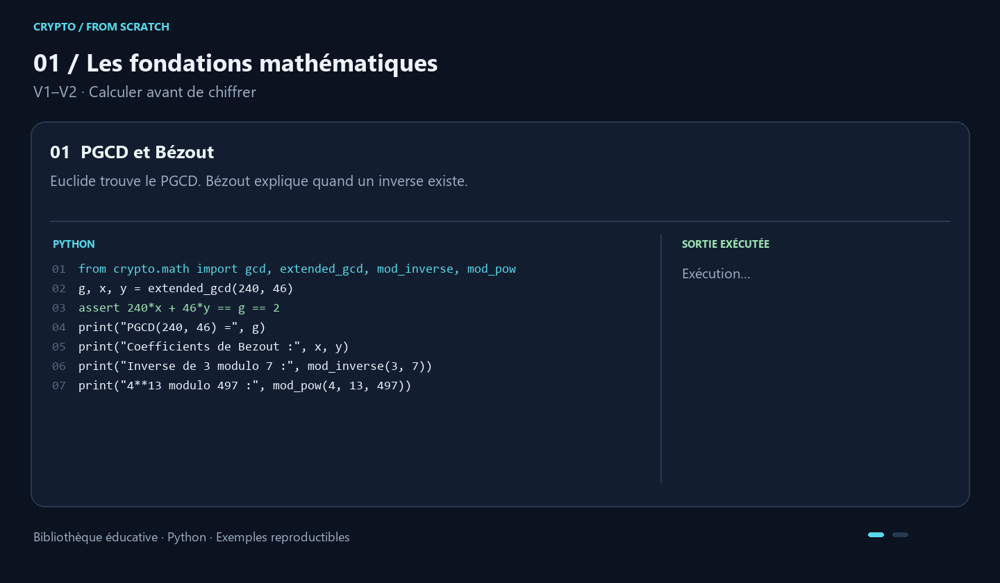

[Image fixe](docs/assets/math.png) · Exécuter : `python -m examples.tour math`

<details>
<summary>Lire le code et les résultats de cette démonstration</summary>

**PGCD et Bézout.** Euclide trouve le PGCD. Bézout explique quand un inverse existe.

```python
from crypto.math import gcd, extended_gcd, mod_inverse, mod_pow
g, x, y = extended_gcd(240, 46)
assert 240*x + 46*y == g == 2
print("PGCD(240, 46) =", g)
print("Coefficients de Bezout :", x, y)
print("Inverse de 3 modulo 7 :", mod_inverse(3, 7))
print("4**13 modulo 497 :", mod_pow(4, 13, 497))
```

```text
PGCD(240, 46) = 2
Coefficients de Bezout : -9 47
Inverse de 3 modulo 7 : 5
4**13 modulo 497 : 445
```

**Premiers et facteurs.** Miller–Rabin teste les candidats ; la division retrouve les petits facteurs.

```python
from crypto.math import generate_prime, is_probable_prime, factorize
prime = generate_prime(64)
assert prime.bit_length() == 64
print("Premier genere :", prime.bit_length(), "bits")
print("Test Miller-Rabin :", is_probable_prime(prime))
print("Facteurs de 3233 :", factorize(3233))
```

```text
Premier genere : 64 bits
Test Miller-Rabin : True
Facteurs de 3233 : [53, 61]
```

</details>

<a id="demo-rsa"></a>

### 02 / RSA : du nombre au message

V3–V4 · Clés, encodage et reconstruction.

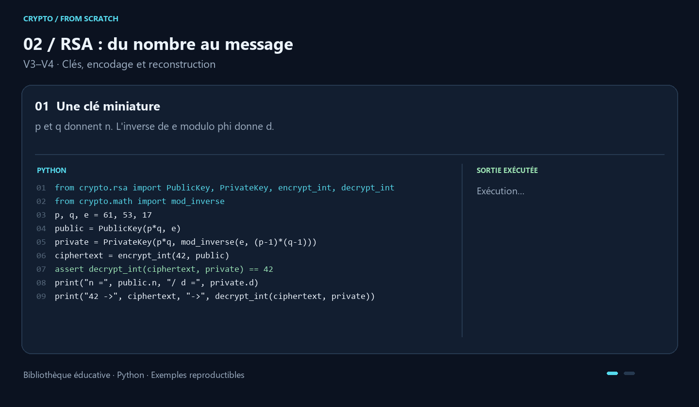

[Image fixe](docs/assets/rsa.png) · Exécuter : `python -m examples.tour rsa`

<details>
<summary>Lire le code et les résultats de cette démonstration</summary>

**Une clé miniature.** p et q donnent n. L'inverse de e modulo phi donne d.

```python
from crypto.rsa import PublicKey, PrivateKey, encrypt_int, decrypt_int
from crypto.math import mod_inverse
p, q, e = 61, 53, 17
public = PublicKey(p*q, e)
private = PrivateKey(p*q, mod_inverse(e, (p-1)*(q-1)))
ciphertext = encrypt_int(42, public)
assert decrypt_int(ciphertext, private) == 42
print("n =", public.n, "/ d =", private.d)
print("42 ->", ciphertext, "->", decrypt_int(ciphertext, private))
```

```text
n = 3233 / d = 2753
42 -> 2557 -> 42
```

**Texte, blocs et JSON.** L'encodage préserve les octets et leur longueur. Il ne remplace pas OAEP.

```python
from crypto.rsa import generate_keypair, encrypt_text, decrypt_text
public, private = generate_keypair(256)
encrypted = encrypt_text("Bonjour, RSA !", public)
assert PublicKey.from_json(public.to_json()) == public
print("Blocs chiffres :", len(encrypted.blocks))
print("Message retrouve :", decrypt_text(encrypted, private))
print("Cle publique JSON : aller-retour OK")
```

```text
Blocs chiffres : 1
Message retrouve : Bonjour, RSA !
Cle publique JSON : aller-retour OK
```

</details>

<a id="demo-dh"></a>

### 03 / Établir un secret commun

V5 · Diffie–Hellman, sans envoyer le secret.

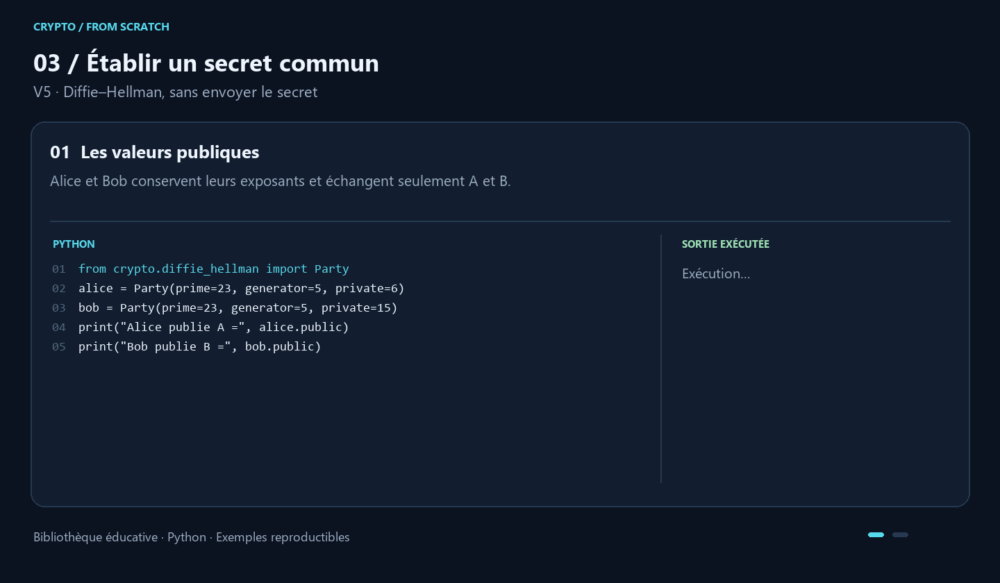

[Image fixe](docs/assets/dh.png) · Exécuter : `python -m examples.tour dh`

<details>
<summary>Lire le code et les résultats de cette démonstration</summary>

**Les valeurs publiques.** Alice et Bob conservent leurs exposants et échangent seulement A et B.

```python
from crypto.diffie_hellman import Party
alice = Party(prime=23, generator=5, private=6)
bob = Party(prime=23, generator=5, private=15)
print("Alice publie A =", alice.public)
print("Bob publie B =", bob.public)
```

```text
Alice publie A = 8
Bob publie B = 19
```

**Le même résultat.** Les deux calculs donnent g^(ab) mod p. L'identité du pair reste à vérifier.

```python
secret_a = alice.shared_secret(bob.public)
secret_b = bob.shared_secret(alice.public)
assert secret_a == secret_b
print("Secret Alice :", secret_a)
print("Secret Bob   :", secret_b)
print("Secrets identiques :", secret_a == secret_b)
```

```text
Secret Alice : 2
Secret Bob   : 2
Secrets identiques : True
```

</details>

<a id="demo-hash"></a>

### 04 / Un bit change l'empreinte

V6–V7 · SHA-256 et effet avalanche.

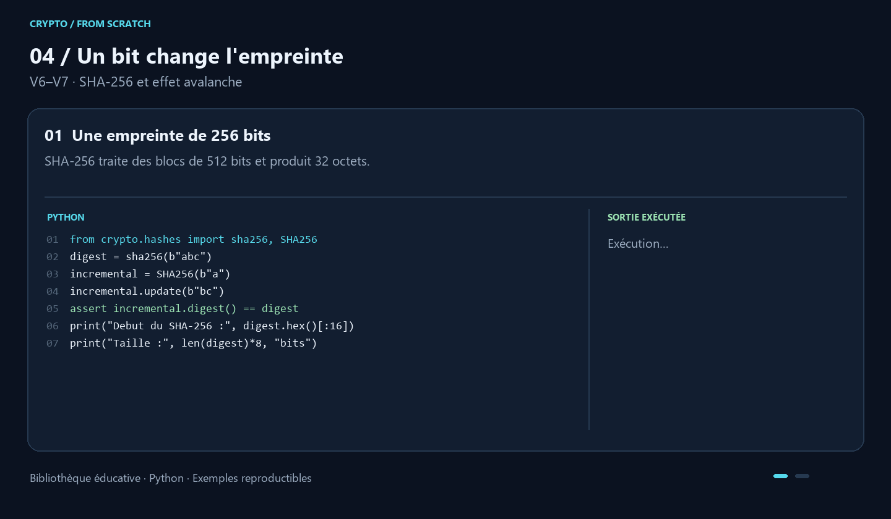

[Image fixe](docs/assets/hash.png) · Exécuter : `python -m examples.tour hash`

<details>
<summary>Lire le code et les résultats de cette démonstration</summary>

**Une empreinte de 256 bits.** SHA-256 traite des blocs de 512 bits et produit 32 octets.

```python
from crypto.hashes import sha256, SHA256
digest = sha256(b"abc")
incremental = SHA256(b"a")
incremental.update(b"bc")
assert incremental.digest() == digest
print("Debut du SHA-256 :", digest.hex()[:16])
print("Taille :", len(digest)*8, "bits")
```

```text
Debut du SHA-256 : ba7816bf8f01cfea
Taille : 256 bits
```

**Mesurer la diffusion.** Chaque bit de Bonjour est modifié séparément ; on compte les bits différents.

```python
from experiments.avalanche.run import measure
result = measure(b"Bonjour")
print("Essais :", len(result.samples))
print("Moyenne :", round(result.average, 2), "/ 256 bits")
print("Proportion :", round(100*result.average_ratio, 2), "%")
```

```text
Essais : 56
Moyenne : 127.2 / 256 bits
Proportion : 49.69 %
```

</details>

<a id="demo-aes"></a>

### 05 / AES, tour après tour

V8 · AES-128, AES-192 et AES-256.

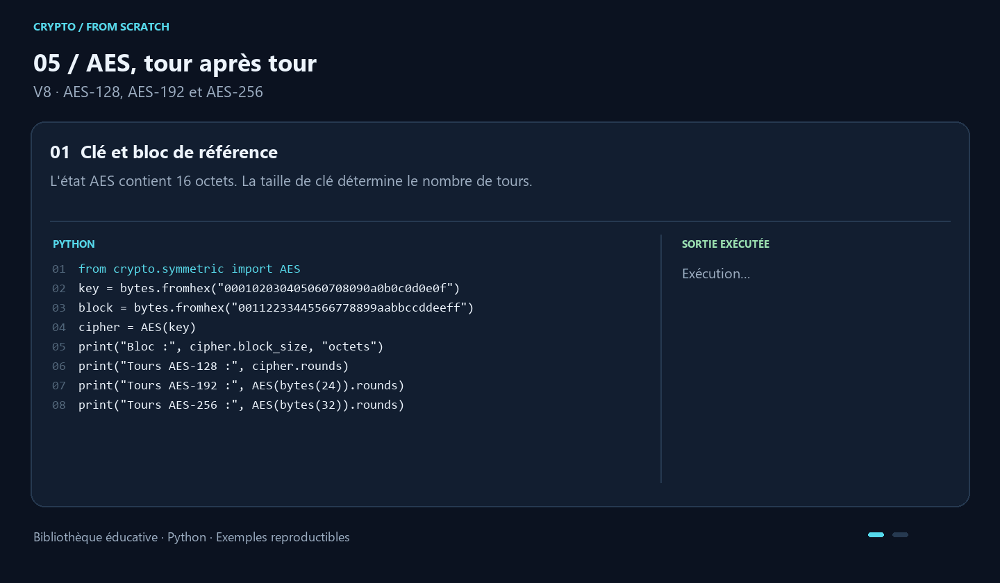

[Image fixe](docs/assets/aes.png) · Exécuter : `python -m examples.tour aes`

<details>
<summary>Lire le code et les résultats de cette démonstration</summary>

**Clé et bloc de référence.** L'état AES contient 16 octets. La taille de clé détermine le nombre de tours.

```python
from crypto.symmetric import AES
key = bytes.fromhex("000102030405060708090a0b0c0d0e0f")
block = bytes.fromhex("00112233445566778899aabbccddeeff")
cipher = AES(key)
print("Bloc :", cipher.block_size, "octets")
print("Tours AES-128 :", cipher.rounds)
print("Tours AES-192 :", AES(bytes(24)).rounds)
print("Tours AES-256 :", AES(bytes(32)).rounds)
```

```text
Bloc : 16 octets
Tours AES-128 : 10
Tours AES-192 : 12
Tours AES-256 : 14
```

**Vecteur connu et retour.** SubBytes, ShiftRows, MixColumns et AddRoundKey transforment l'état.

```python
encrypted = cipher.encrypt_block(block)
assert encrypted.hex() == "69c4e0d86a7b0430d8cdb78070b4c55a"
assert cipher.decrypt_block(encrypted) == block
print("Chiffre (hex) :")
print(encrypted.hex())
print("Dechiffrement : bloc initial retrouve")
```

```text
Chiffre (hex) :
69c4e0d86a7b0430d8cdb78070b4c55a
Dechiffrement : bloc initial retrouve
```

</details>

<a id="demo-modes"></a>

### 06 / Choisir un mode

V9 · ECB, CBC, CTR et AES-GCM.

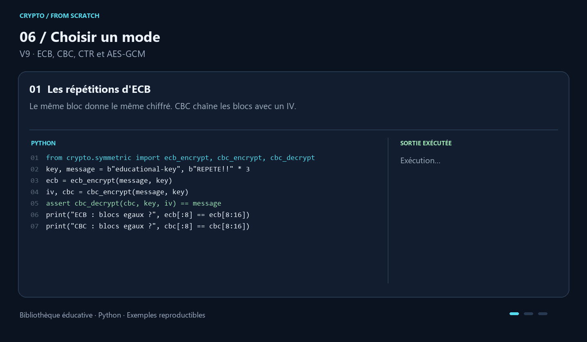

[Image fixe](docs/assets/modes.png) · Exécuter : `python -m examples.tour modes`

<details>
<summary>Lire le code et les résultats de cette démonstration</summary>

**Les répétitions d'ECB.** Le même bloc donne le même chiffré. CBC chaîne les blocs avec un IV.

```python
from crypto.symmetric import ecb_encrypt, cbc_encrypt, cbc_decrypt
key, message = b"educational-key", b"REPETE!!" * 3
ecb = ecb_encrypt(message, key)
iv, cbc = cbc_encrypt(message, key)
assert cbc_decrypt(cbc, key, iv) == message
print("ECB : blocs egaux ?", ecb[:8] == ecb[8:16])
print("CBC : blocs egaux ?", cbc[:8] == cbc[8:16])
```

```text
ECB : blocs egaux ? True
CBC : blocs egaux ? False
```

**CTR : un flux réversible.** CTR applique un XOR avec le flux chiffré. Ne jamais réutiliser le nonce.

```python
from crypto.symmetric import ctr_crypt
nonce = b"demo"
ciphertext = ctr_crypt(message, key, nonce)
assert ctr_crypt(ciphertext, key, nonce) == message
print("Sans padding :", len(ciphertext) == len(message))
print("Retour CTR :", ctr_crypt(ciphertext, key, nonce).decode())
```

```text
Sans padding : True
Retour CTR : REPETE!!REPETE!!REPETE!!
```

**GCM : chiffrer et authentifier.** Le tag protège le chiffré et l'en-tête AAD. Il est vérifié avant déchiffrement.

```python
from crypto.symmetric import gcm_encrypt, gcm_decrypt
aes_key = bytes(range(16))
nonce, ciphertext, tag = gcm_encrypt(b"Bonjour", aes_key, aad=b"Alice")
plaintext = gcm_decrypt(ciphertext, aes_key, nonce, tag, aad=b"Alice")
assert plaintext == b"Bonjour"
print("Message :", plaintext.decode())
print("Nonce / tag :", len(nonce), "/", len(tag), "octets")
```

```text
Message : Bonjour
Nonce / tag : 12 / 16 octets
```

</details>

<a id="demo-authentication"></a>

### 07 / Prouver et vérifier

V10–V11 · HMAC et signature RSA pédagogique.

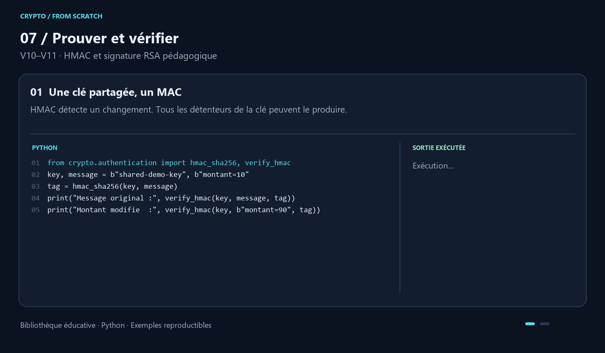

[Image fixe](docs/assets/authentication.png) · Exécuter : `python -m examples.tour authentication`

<details>
<summary>Lire le code et les résultats de cette démonstration</summary>

**Une clé partagée, un MAC.** HMAC détecte un changement. Tous les détenteurs de la clé peuvent le produire.

```python
from crypto.authentication import hmac_sha256, verify_hmac
key, message = b"shared-demo-key", b"montant=10"
tag = hmac_sha256(key, message)
print("Message original :", verify_hmac(key, message, tag))
print("Montant modifie  :", verify_hmac(key, b"montant=90", tag))
```

```text
Message original : True
Montant modifie  : False
```

**Une clé privée, une signature.** La clé publique vérifie. Cette démonstration RSA n'implémente pas PSS.

```python
from crypto.rsa import generate_keypair
from crypto.signatures import sign, verify
public, private = generate_keypair(512)
signature = sign(message, private)
print("Signature valide :", verify(message, signature, public))
print("Message modifie   :", verify(message+b"!", signature, public))
```

```text
Signature valide : True
Message modifie   : False
```

</details>

<a id="demo-channel"></a>

### 08 / Alice parle à Bob

V12 · Authentifier, chiffrer, contrôler le rejeu.

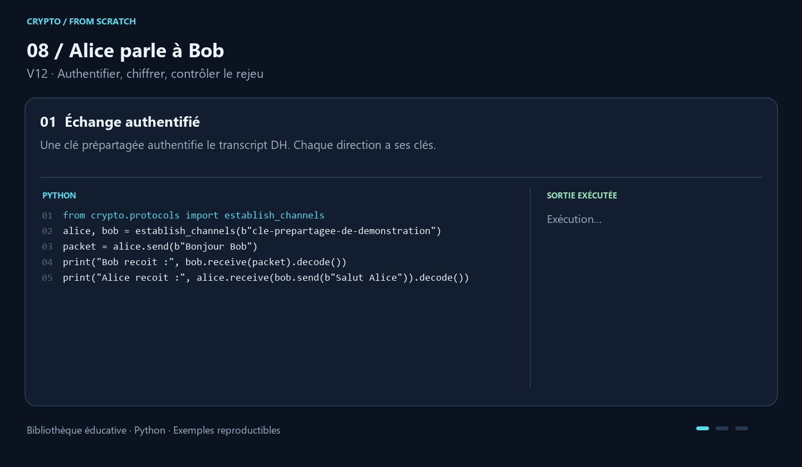

[Image fixe](docs/assets/channel.png) · Exécuter : `python -m examples.tour channel`

<details>
<summary>Lire le code et les résultats de cette démonstration</summary>

**Échange authentifié.** Une clé prépartagée authentifie le transcript DH. Chaque direction a ses clés.

```python
from crypto.protocols import establish_channels
alice, bob = establish_channels(b"cle-prepartagee-de-demonstration")
packet = alice.send(b"Bonjour Bob")
print("Bob recoit :", bob.receive(packet).decode())
print("Alice recoit :", alice.receive(bob.send(b"Salut Alice")).decode())
```

```text
Bob recoit : Bonjour Bob
Alice recoit : Salut Alice
```

**Rejeter le rejeu.** Le compteur mémorise l'ordre. Un paquet déjà accepté ne peut pas être relu.

```python
try:
    bob.receive(packet)
except ValueError:
    print("Ancien paquet : REJETE")
```

```text
Ancien paquet : REJETE
```

**Détecter l'altération.** Le destinataire vérifie le HMAC avant de déchiffrer le contenu.

```python
from dataclasses import replace
next_packet = alice.send(b"Message suivant")
try:
    bob.receive(replace(next_packet, tag=bytes(32)))
except ValueError:
    print("Tag modifie : REJETE")
print("Original accepte :", bob.receive(next_packet).decode())
```

```text
Tag modifie : REJETE
Original accepte : Message suivant
```

</details>

<a id="demo-attacks"></a>

### 09 / Casser des paramètres jouets

V13 · Cinq expériences locales et bornées.

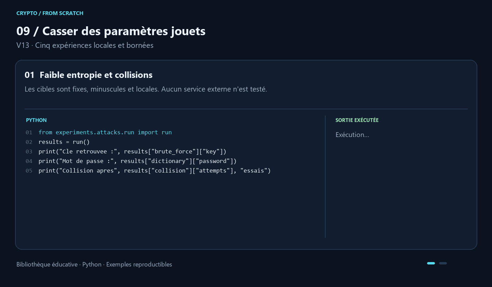

[Image fixe](docs/assets/attacks.png) · Exécuter : `python -m examples.tour attacks`

<details>
<summary>Lire le code et les résultats de cette démonstration</summary>

**Faible entropie et collisions.** Les cibles sont fixes, minuscules et locales. Aucun service externe n'est testé.

```python
from experiments.attacks.run import run
results = run()
print("Cle retrouvee :", results["brute_force"]["key"])
print("Mot de passe :", results["dictionary"]["password"])
print("Collision apres", results["collision"]["attempts"], "essais")
```

```text
Cle retrouvee : 173
Mot de passe : bonjour123
Collision apres 54 essais
```

**MITM et factorisation.** Un DH sans identité permet deux secrets ; les facteurs RSA redonnent la clé.

```python
mitm = results["mitm"]
print("Secret Alice / Bob :", mitm["alice_secret"], "/", mitm["bob_secret"])
print("Mallory intercepte :", mitm["intercepted"])
rsa = results["factorization"]
print("Facteurs RSA :", rsa["p"], rsa["q"])
print("Message retrouve :", rsa["recovered_message"])
```

```text
Secret Alice / Bob : 6 / 15
Mallory intercepte : True
Facteurs RSA : 53 61
Message retrouve : 42
```

</details>

<a id="demo-benchmarks"></a>

### 10 / Mesurer avant de conclure

V14 · Charges fixes, temps et allocations.

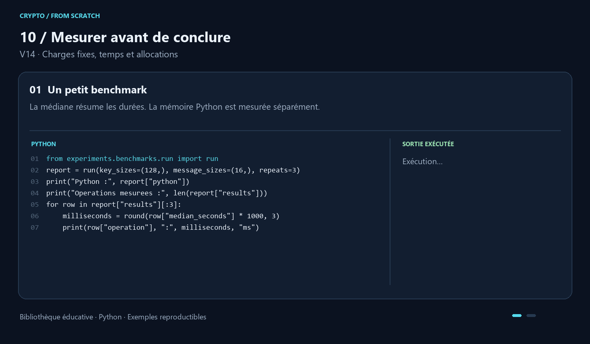

[Image fixe](docs/assets/benchmarks.png) · Exécuter : `python -m examples.tour benchmarks`

<details>
<summary>Lire le code et les résultats de cette démonstration</summary>

**Un petit benchmark.** La médiane résume les durées. La mémoire Python est mesurée séparément.

```python
from experiments.benchmarks.run import run
report = run(key_sizes=(128,), message_sizes=(16,), repeats=3)
print("Python :", report["python"])
print("Operations mesurees :", len(report["results"]))
for row in report["results"][:3]:
    milliseconds = round(row["median_seconds"] * 1000, 3)
    print(row["operation"], ":", milliseconds, "ms")
```

```text
Python : 3.14.2
Operations mesurees : 6
rsa_keygen : 0.752 ms
rsa_encrypt : 0.013 ms
rsa_decrypt : 0.121 ms
```

**Ce que les chiffres signifient.** Les résultats dépendent de la machine. Les petites clés restent pédagogiques.

```python
row = report["results"][0]
print("Repetitions :", row["repeats"])
print("Pic d'allocations Python :", row["peak_python_bytes"], "octets")
print("Ce pic n'est pas la RAM du processus.")
print("Un benchmark n'est pas une preuve de securite.")
```

```text
Repetitions : 3
Pic d'allocations Python : 940 octets
Ce pic n'est pas la RAM du processus.
Un benchmark n'est pas une preuve de securite.
```

</details>

<a id="reference-api"></a>

## Référence des interfaces publiques

Les opérations sur les messages attendent des `bytes`. Pour un texte, utiliser
`.encode("utf-8")` avant et `.decode("utf-8")` après ; RSA possède aussi les
raccourcis `encrypt_text` et `decrypt_text`. Les entiers cryptographiques sont
non signés ; la conversion octets/entiers se fait en ordre big-endian.

### Mathématiques — `crypto.math`

| Interface | Résultat et contrat |
|---|---|
| `gcd(a, b)` | PGCD positif ou nul ; accepte les entiers négatifs |
| `extended_gcd(a, b)` | `(g, x, y)` avec `a*x + b*y == g` |
| `mod_inverse(a, modulus)` | Inverse modulo `modulus > 1` ; `ValueError` si inexistant |
| `mod_pow(base, exponent, modulus)` | Exponentiation rapide, module positif ; exposant négatif via l'inverse |
| `is_prime(n)` | Division d'essai déterministe, destinée aux petits entiers |
| `is_probable_prime(n, rounds=40)` | Sept bases déterministes sous `2**64`, témoins aléatoires au-delà |
| `generate_prime(bits, rounds=40)` | Premier probable impair d'exactement `bits >= 2` bits |
| `factorize(n)` | Facteurs premiers avec multiplicité, `n >= 1` ; `factorize(1) == []` |

Miller–Rabin décompose `n-1 = 2**s * d`. Pour un entier composé fixé et des bases
aléatoires indépendantes, la borne d'acceptation erronée est `4**(-rounds)`.
Ce n'est pas une probabilité a posteriori qu'un nombre accepté soit composé.
La génération utilise `secrets`, pas le générateur pseudo-aléatoire de `random`.

### RSA — `crypto.rsa`

| Interface | Résultat et contrat |
|---|---|
| `generate_keypair(bits=1024, public_exponent=65537)` | `(PublicKey, PrivateKey)` ; modulus d'environ `bits` bits |
| `PublicKey(n, e)` / `PrivateKey(n, d, p=None, q=None)` | Objets immuables ; facteurs privés facultatifs |
| `key.to_json()` / `KeyClass.from_json(text)` | Sérialisation JSON ; privée non chiffrée, facteurs exclus par défaut |
| `private.to_json(include_primes=True)` | Inclut les facteurs privés pour l'étude |
| `encrypt_int(m, public)` / `decrypt_int(c, private)` | RSA brut ; exige `0 <= valeur < n` |
| `encrypt_bytes(message, public)` | `EncryptedMessage(blocks, length)` |
| `decrypt_bytes(encrypted, private)` | Reconstitue les octets, y compris les zéros initiaux |
| `encrypt_text(text, public, encoding="utf-8")` | Encode puis chiffre par blocs |
| `decrypt_text(encrypted, private, encoding="utf-8")` | Déchiffre puis décode |

Le bloc clair mesure `(n.bit_length()-1)//8` octets. La longueur totale est
conservée pour reconstruire le dernier bloc. Ce format ne fournit aucun padding
de sécurité, aucun MAC et aucune confidentialité de la longueur. Les clés JSON
privées sont des secrets en clair. Voir [RSA et OAEP](docs/cryptography/rsa.md).

### Diffie–Hellman — `crypto.diffie_hellman`

| Interface | Résultat et contrat |
|---|---|
| `Party(prime, generator, private=None)` | Valide les paramètres ; choisit un exposant secret si absent |
| `party.public` | Valeur publique `g**a mod p` |
| `party.shared_secret(peer_public)` | Entier partagé ; rejette les valeurs publiques triviales |
| `generate_private_key(prime)` | Exposant uniforme dans `[2, p-2]` ; primalité à valider séparément |
| `public_key(private, prime, generator)` | Calcul de valeur publique avec validation |
| `derive_shared_secret(peer_public, private, prime)` | Calcul du secret partagé avec validation |

Le module général n'authentifie pas le pair et ne garantit pas l'ordre du
sous-groupe choisi. Un entier DH n'est pas directement une clé AES ; le canal
ajoute sa propre dérivation et une authentification prépartagée.

### Hash et authentification

| Import | Interface | Résultat |
|---|---|---|
| `crypto.hashes` | `educational_hash(data)` | Petit hash pédagogique de 32 bits, non cryptographique |
| `crypto.hashes` | `sha256(data)` | Empreinte de 32 octets |
| `crypto.hashes` | `SHA256(data=b"")` | `update`, `digest`, `hexdigest`, `copy` ; conserve les données en mémoire |
| `crypto.authentication` | `hmac_sha256(key, message)` | Tag complet de 32 octets |
| `crypto.authentication` | `verify_hmac(key, message, tag)` | Booléen ; comparaison avec `compare_digest` |
| `crypto.signatures` | `sign(message, private)` | Signature RSA brute d'un condensat SHA-256, sous forme d'entier |
| `crypto.signatures` | `verify(message, signature, public)` | Booléen ; rejette une signature hors intervalle |

La signature exige `n > 2**256-1`, pour contenir tous les condensats possibles.
Elle n'implémente pas RSA-PSS. RSA-PSS, ECDSA et EdDSA sont comparés dans
[l'étude des signatures](docs/cryptography/authentication.md).

### Symétrique — `crypto.symmetric`

| Interface | Taille / résultat |
|---|---|
| `FeistelCipher(key)` | Clé d'au moins 8 octets, blocs de 8 octets, 16 tours |
| `AES(key)` | Clé de 16/24/32 octets, blocs de 16 octets, 10/12/14 tours |
| `cipher.encrypt_block(block)` / `decrypt_block(block)` | Un bloc exact, sans padding ni authentification |
| `pkcs7_pad(data, block_size=8)` / `pkcs7_unpad(...)` | Padding PKCS#7 ; tailles de bloc de 1 à 255 |
| `ecb_encrypt(plaintext, key)` / `ecb_decrypt(ciphertext, key)` | **Feistel** ECB avec PKCS#7 |
| `cbc_encrypt(plaintext, key, iv=None)` | **Feistel** CBC ; renvoie `(iv, ciphertext)`, IV de 8 octets |
| `cbc_decrypt(ciphertext, key, iv)` | Déchiffrement CBC puis retrait du padding |
| `ctr_crypt(data, key, nonce)` | **Feistel** CTR ; nonce de 4 octets et compteur de 32 bits, sans padding |
| `gcm_encrypt(plaintext, key, nonce=None, aad=b"")` | **AES-GCM** ; renvoie `(nonce, ciphertext, tag)` |
| `gcm_decrypt(ciphertext, key, nonce, tag, aad=b"")` | Vérifie le tag puis renvoie le clair, sinon `ValueError` |

GCM génère par défaut un nonce aléatoire de 12 octets. Il prend aussi en charge
les autres longueurs non nulles via GHASH ; les tags doivent faire exactement
16 octets. Les AAD sont authentifiées mais **pas chiffrées**. Conserver nonce,
tag et AAD avec le chiffré. La bibliothèque ne mémorise pas les nonces utilisés :
ne jamais réutiliser un nonce avec la même clé. Un nonce fixe dans un vecteur de
test ou un benchmark ne constitue pas une règle d'utilisation.

AES-GCM utilise le compteur sur 32 bits et le produit dans `GF(2**128)` ; il
rejette les données excédant `2**36-32` octets. Il n'expose pas de clair si le tag
échoue. Détails : [AES et GCM](docs/cryptography/aes_gcm.md).

### Canal — `crypto.protocols`

| Interface | Fonction |
|---|---|
| `Handshake(role, authentication_key)` | Rôle `alice` ou `bob`, clé prépartagée d'au moins 16 octets |
| `handshake.hello` | `Hello(role, public, nonce)` à échanger |
| `handshake.proof(peer_hello)` | HMAC du transcript canonique et du rôle émetteur |
| `handshake.finish(peer_hello, peer_proof)` | Vérifie la preuve et crée un `SecureChannel` ; usage unique |
| `establish_channels(key)` | Raccourci de simulation : `(alice_channel, bob_channel)` |
| `channel.send(message)` | `Packet(sequence, iv, ciphertext, tag)` |
| `channel.receive(packet)` | Vérifie ordre et tag, déchiffre, puis avance le compteur |

Le canal utilise DH + **Feistel-CBC + HMAC**, avec des clés séparées par direction
et fonction. AES-GCM est disponible séparément pour comparer les constructions.
Le transcript lie les deux nonces, les valeurs DH, les paramètres et les rôles.
Les tests couvrent altération, réflexion, autre session, rejeu et mauvais ordre.
Les paquets doivent être livrés dans l'ordre. Aucun réseau, certificat,
stockage de session ni accès concurrent n'est implémenté : le cahier des charges
demande une simulation. Voir [le protocole détaillé](docs/cryptography/secure_channel.md).

<a id="experiences"></a>

## Expériences et résultats

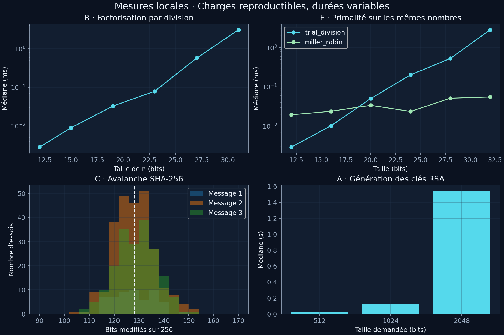

Les [données JSON](docs/results/science.json) contiennent les entrées, paramètres,
mesures et métadonnées de la machine. Les [rapports A–F](docs/experiments.md)
présentent hypothèse, protocole, données, résultats, interprétation et conclusion.
Les durées sont des observations locales ; aucune performance universelle n'est
promise.

| Expérience | Ce qui est mesuré / observé |
|---|---|
| A · Taille RSA | Génération de clés de 512, 1024 et 2048 bits |
| B · Factorisation | Division d'essai sur six semipremiers croissants |
| C · Avalanche | Un bit modifié, trois messages et distribution des distances |
| D · ECB/CBC | Même matrice répétitive, comparaison des blocs chiffrés |
| E · DH et MITM | Deux secrets connus de Mallory dans un échange non authentifié |
| F · Paramètres | Primalité, nombre de témoins, tailles DH, AES-GCM, temps et mémoire |

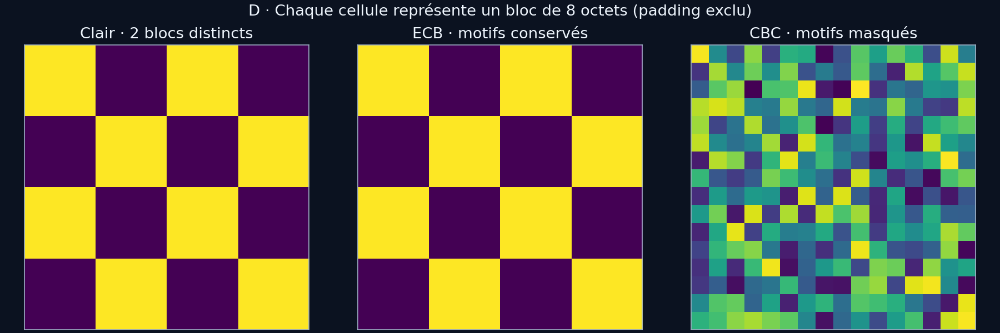

Chaque cellule représente **un bloc de 8 octets**, avec une couleur par valeur
distincte ; ce n'est pas une image directement chiffrée pixel par pixel. Le
padding est exclu. Les données fixes donnent 2 blocs distincts en clair et en
ECB, contre 256 pour CBC dans cette expérience. Cela illustre les répétitions,
sans prouver la sécurité de Feistel ni de CBC.

### Toutes les commandes

```powershell
# Parcours complet, ou une demonstration : math, rsa, dh, hash, aes,
# modes, authentication, channel, attacks, benchmarks
python -m examples.tour
python -m examples.tour aes

# Demonstrations autonomes
python -m examples.authentication
python -m examples.aes_gcm
python -m examples.secure_channel
python -m experiments.avalanche.run
python -m experiments.modes.ecb_vs_cbc
python -m experiments.attacks.run

# Benchmarks RSA / SHA-256 / Feistel : sortie JSON
python -m experiments.benchmarks.run --key-sizes 512 1024 2048 --message-sizes 16 256 1024 --repeats 3

# Donnees completes A-F, primalite, DH et AES-GCM
python -m experiments.science.run --repeats 3

# Variante rapide, sans les benchmarks RSA et AES-GCM
python -m experiments.science.run --quick --output docs/results/quick.json

# Reconstruction des GIFs, images, graphiques et README
python -m scripts.build_docs
```

Les benchmarks réalisent une chauffe, puis plusieurs mesures avec
`perf_counter`. Une exécution séparée sous `tracemalloc` mesure les allocations
Python sans perturber les durées. Les pics n'incluent ni toute la RAM du
processus ni toutes les allocations natives. Les messages sont fixes ; les clés
RSA et les témoins probabilistes sont aléatoires. Pour comparer deux machines,
conserver paramètres, répétitions et versions, et lire les médianes avec prudence.

<a id="validation"></a>

## Tests et vérification

```powershell
python -m pytest
python -m scripts.verify_docs
```

| Domaine | Vérifications |
|---|---|
| Mathématiques | Identités, inverses, primalité, composites de Carmichael, facteurs |
| RSA | Entiers, blocs, Unicode, zéros initiaux, clés JSON et données invalides |
| DH | Secrets égaux, paramètres et valeurs publiques invalides |
| SHA-256 / HMAC | Vecteurs connus, frontières de blocs et comparaison à `hashlib` / `hmac` |
| AES | Vecteurs FIPS 197 pour 128/192/256 bits et comparaison indépendante |
| AES-GCM | Vecteurs connus, blocs partiels, AAD, plusieurs tailles de nonce, tags altérés |
| Feistel / modes | Inversion, répétitions ECB, CBC, CTR et padding |
| Signatures | Message altéré, mauvaise clé, signature hors intervalle |
| Protocole | Authentification du transcript, intégrité avant déchiffrement, rejeu, ordre et session |
| Expériences | Facteurs retrouvés, vraie collision tronquée, secrets MITM et rapports |
| Documentation | Exemples exécutés, liens locaux, GIFs multi-images et sorties présentes |

Les comparaisons AES/GCM à `cryptography` sont activées par l'extra `[test]` ;
sans cette dépendance, pytest les marque comme ignorées. Les vecteurs connus
restent exécutés. Le workflow [CI](.github/workflows/tests.yml) installe l'extra
et lance les tests sous Python 3.10, 3.12 et 3.14. Les GIFs sont générés localement
depuis les mêmes exemples que ceux vérifiés dans les tests.

## Organisation et contribution

```text
crypto/
  math/              Euclide, primalité et factorisation
  rsa/               Clés, RSA brut et messages par blocs
  diffie_hellman/     Échange de secret
  hashes/            Hash pédagogique et SHA-256
  symmetric/         Feistel, AES, ECB/CBC/CTR et GCM
  authentication/    HMAC-SHA256
  signatures/        Signature RSA pédagogique
  protocols/         Handshake et canal en mémoire
examples/            Démonstrations et source du parcours animé
experiments/         Avalanche, modes, attaques, benchmarks et études A-F
tests/               Tests unitaires, vecteurs et comparaisons indépendantes
scripts/             Génération et vérification documentaire
docs/
  assets/            GIFs, images fixes et graphiques
  results/           Données expérimentales et sorties des exemples
  cryptography/      Explications des algorithmes
  mathematics/       Fondations mathématiques
  security/          Limites et expériences d'attaques
```

Pour modifier une démonstration, éditer `examples/tour.py`. Le README est généré
à partir de ces exemples et de `docs/readme_header.md` / `docs/readme_footer.md`.
Après modification, lancer les tests puis `python -m scripts.build_docs` et
`python -m scripts.verify_docs`. Les dépendances graphiques restent facultatives
et ne doivent jamais entrer dans `crypto/`. Voir [CONTRIBUTING.md](CONTRIBUTING.md).

## Limites et différences avec un système réel

| Ici | Dans une application réelle |
|---|---|
| Petites clés RSA et RSA brut | Primitives auditées et encodage OAEP/PSS approprié |
| DH jouet et clé prépartagée de démonstration | Paramètres reconnus, identités vérifiées et protocole établi |
| Feistel inventé, blocs de 64 bits | Chiffrement authentifié standard via une bibliothèque auditée |
| AES et GCM en Python, tables et branches | Implémentation auditée et protections contre les canaux auxiliaires |
| Clés en mémoire et JSON en clair | Gestion, stockage et rotation des secrets adaptés |
| Compteurs en mémoire, simulation locale | Transport, persistance et gestion des sessions |

Une conformité aux vecteurs de test ne constitue ni un audit, ni une
certification NIST, ni une preuve de résistance aux attaques. La comparaison
du HMAC utilise `compare_digest`, mais le programme entier n'est pas à temps
constant. Les détails sont dans [les limites de sécurité](docs/security/limitations.md).

## Références et licence

- [FIPS 197 — AES](https://csrc.nist.gov/pubs/fips/197/final) : structure, expansion de clé et tours.
- [NIST SP 800-38D — GCM](https://csrc.nist.gov/pubs/sp/800/38/d/final) : compteur, GHASH et authentification.
- [FIPS 180-4 — SHA-256](https://csrc.nist.gov/pubs/fips/180-4/upd1/final) : fonctions de hachage.
- [RFC 2104 — HMAC](https://www.rfc-editor.org/rfc/rfc2104) et [RFC 4231 — vecteurs HMAC](https://www.rfc-editor.org/rfc/rfc4231).
- [RFC 8017 — RSA, OAEP et PSS](https://www.rfc-editor.org/rfc/rfc8017).
- [RFC 8032 — EdDSA](https://www.rfc-editor.org/rfc/rfc8032).
- [Cahier des charges original](maharavo.txt) et [documentation complète](docs/README.md).

Code et ressources générées distribués sous [licence MIT](LICENSE).
